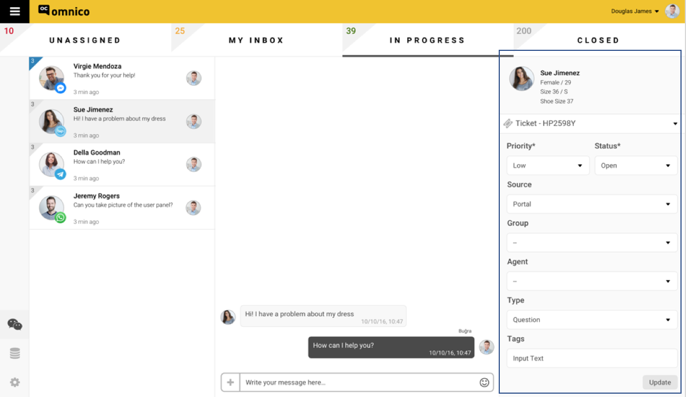

# Kullanıcılarınızla Sohbet Etmeye Başlayın!

Bütün kurulumları yaptıktan sonra, artık '**Omnico Müşteri Temsilcisi Ekranınızı**' açıp, müşterilerinizle konuşmaya başlayabilirsiniz!

## Omnico Müşteri Temsilcisi Ekranı ve Özellikleri 

**Aşağıda gördüğünüz ekran, sizin 'müşteri temsilcisi ekranı'nızdır.**

_Bu ekrandaki özellikler ve işlevleri sırasıyla aşağıdaki gibidir;_

1. Aşağıda sol tarafta gördüğünüz alan, sizin 'Universal Inbox'unuz. Bu özellik sayesinde, müşteri temsilcileri, farklı kanallardan gelen mesajları (Facebook, Telegram, Whatsapp, BİP, vs) tek bir yerden görüntüleyip, aksiyona geçebilecektir.

Yan ekrana düşen mesajların, aşağıdaki özellikleri 'Müşteri Temsilcisi Ekranı'nda sırasıyla aşağıdaki gibi görüntülenecektir:

●	Müşteri İsmi
●	Gelen kanalın logosu
●	Bildirinin düştüğü zaman

2. Aşağıda gösterilen işaretli alan, müşteri temsilcilerinin 'chat box'udur. Müşteri temsilcileri, hem gelen mesajları bu alanda görüntüleyecek, hem de buradan geri dönüş yapacaklardır. 

3. Aşağıda sağ tarafta gördüğünüz alan, müşterilere ve gelen bildirilere ait olan alandır. 

**Biz Omnico olarak, gelen her bildiriye 'Ticket' diyoruz.** 

**Ticket Nedir?**

Platforma, müşteriden bir ‘talep/bildiri/istek’düştüğü anda, hangi kanaldan düşerse düşsün, o mesaj, otomatik olarak bir ‘Ticket’a dönüştürülür. 

Dolayısıyla, aşağıda işaretli gördüğünüz alan hem ticket'lar hem de müşteriler için ayrılmış bir alandır diyebiliriz. 

Her kutucuğun özellikleri ve işlevi aşağıdaki gibidir:

●	Customer Details (Müşteri Bilgileri)

Eğer CRM, e-ticaret veya Ticket Management entegrasyonlarınızı Omnico ile entegre etmişseniz, aşağıdaki bilgiler, sırasıyla 'Müşteri Temsilcisi Ekranı'nızın sağ üst tarafında belirecektir. Eğer bu entegrasyonlr gerçekleştirilmediyse, Omnico database'inde tutulan bilgiler sayesinde aşağıdaki bilgiler belirecektir;

1. Cinsiyet
2. Yaş
3. Beden
4. Vb. 
5. Shopping Cart (e-ticaret veya CRM entegrasyonu gereklidir)

●	Ticket Properties (Ticket Özellikleri)

Müşteri temsilcisi bir 'ticket' görüntülediğinde, aşağıdaki seçenekleri manuel olarak seçmelidir:

1. Priority (bir bildirinin önem seviyesi)

Low / Medium / High / Urgent (düşük / orta / yüksek / acil)

2. Status (bildiri statüsü)

Open / pending / resolved / closed / waiting on customer / waiting on third party (açıldı / beklemede / çözüldü / kapandı / müşteri tarafından bekleniyor)

3. Source (bildirinin kaynağı)

Facebook Messenger / Telegram / Whatsapp / etc.

4. Group / Department (Departmanlar, Admin tarafından belirlenip düzenlenecektir. Örnek departman: teknik servis)

5. Agent Name (Müşteri temsilcisi ismi)

6. Activity Based Actions; Call Reason, Category, Sub Category (Bildirinin geliş sebebi)

Question (soru sormak amaçlı)
Incident (bir sorunu çözmek amaçlı)
Problem (problem bildirmek amaçlı)
Feature Request 
▪	….

**Açıklama**:
Her bir ticket birden fazla aktivite barındırabilir ve her aktivitenin kendi statüsü ve kategorisi olabilir. Her bir aktivite, kendi call time/statüsü/vb. parametreleri ile takip edilebilir. Bir ticket’ın ‘solved’ olabilmesi için, ticket içinde bulunan ‘activity based action’larının hepsinin ‘done’ olmuş olması gerekmektedir. 

7. Tags (Tag'ler, bir 'ticket'ı daha kolay takip edebilmek amaçlı belirlenen anahtar kelimelerdir) 

## Omnico Ticket Journey

Sisteme düşen bir ticket, sırasıyla aşağıdaki inbox’lara düşerek ve adımları izleyerek ‘resolved’ veya ‘postponed’ statüsüne sahip olacaktır:

1.	My Inbox
2.	In Progress
3.	Closed

**My Inbox**

Gelen mesajlar, o an için uygun bulunan bir müşteri temsilcisine otomatik olarak atanır ve o Agent’ın “My Inbox” tabına düşer.  Bu bildiriyi kendine atadığı noktada, bu mesaj o ‘agent’ın ‘My Inbox’ tab’ine düşecektir. 

_Not: Agent’lar, bu tab açıkken gelen mesajlara yanıt yazabilecektir. Agent istediği süre kadar gelen bildiriyi bu ‘inbox’da tutabilecek, gerekli gördüğü noktada manuel şekilde ‘in progress’ inbox’una taşıyabilecektir.
In Progress_

**In Progress**

Agent’lar, düşen bildiri/mesajı ‘My Inbox’dan, ‘In Progress’ inbox’una istediği zaman manuel olarak taşıyabilecektir. Bu inbox’u, ‘My Inbox’dan ayıran özellik, ‘In Progress’de üzerinde çalışılmakta olan gönderilerin bulunmasıdır.

**Closed**

Agent, bir ticket ile olan işlemi sonlandırdığında, bu ticket’I ‘Closed’ inbox’una manuel şekilde taşıyabilecektir. 

Sisteme düşen mesaj/bildiri, sırasıyla yukarıdaki adımları izledikten sonra, ‘resolved’ veya ‘postponed’ tag’leri ile tag’lenir.  Bu ticket eğer;

**‘Resolved’** ise, otomatik olarak sistemin veri tabanına aktarılır. 
**‘Postponed'** ise, ya başka bir departman/müşteri temsilcisine aktarılır ya da veri tabanına aktarılır ve daha sonra tekrardan açılır. 

