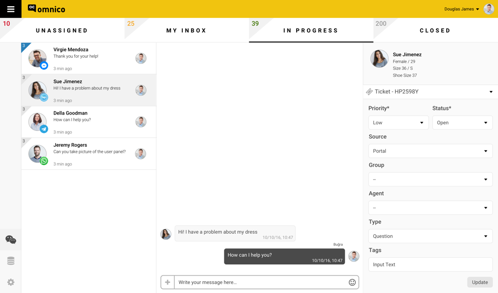
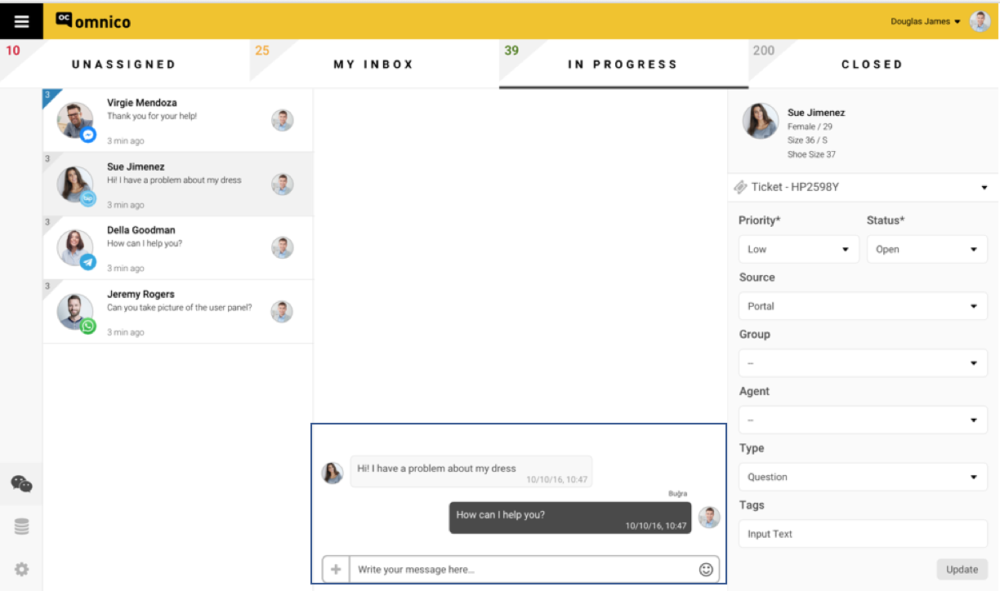

# Kullanıcılarınızla Sohbet Etmeye Başlayın!

Bütün kurulumları yaptıktan sonra, artık '**Omnico Müşteri Temsilcisi Ekranınızı**' açıp, müşterilerinizle konuşmaya başlayabilirsiniz!

## Omnico Müşteri Temsilcisi Ekranı ve Özellikleri 

**Aşağıda gördüğünüz ekran, sizin 'müşteri temsilcisi ekranı'nızdır.**

_Bu ekrandaki özellikler ve işlevleri sırasıyla aşağıdaki gibidir;_

1. Aşağıda sol tarafta gördüğünüz alan, sizin 'Universal Inbox'unuz. Bu özellik sayesinde, müşteri temsilcileri, farklı kanallardan gelen mesajları (Facebook, Telegram, Whatsapp, BİP, vs) tek bir yerden görüntüleyip, aksiyona geçebilecektir.

Yan ekrana düşen mesajların, aşağıdaki özellikleri 'Müşteri Temsilcisi Ekranı'nda sırasıyla aşağıdaki gibi görüntülenecektir:

●	Müşteri İsmi
●	Gelen kanalın logosu
●	Bildirinin düştüğü zaman

2. Aşağıda gösterilen işaretli alan, müşteri temsilcilerinin 'chat box'udur. Müşteri temsilcileri, hem gelen mesajları bu alanda görüntüleyecek, hem de buradan geri dönüş yapacaklardır. 

3. Aşağıda sağ tarafta gördüğünüz alan, müşterilere ve gelen bildirilere ait olan alandır. 

**Biz Omnico olarak, gelen her bildiriye 'Ticket' diyoruz.** 

**Ticket Nedir?**

Platforma, müşteriden bir ‘talep/bildiri/istek’düştüğü anda, hangi kanaldan düşerse düşsün, o mesaj, otomatik olarak bir ‘Ticket’a dönüştürülür. 

Dolayısıyla, aşağıda işaretli gördüğünüz alan hem ticket'lar hem de müşteriler için ayrılmış bir alandır diyebiliriz. 

Her kutucuğun özellikleri ve işlevi aşağıdaki gibidir:

●	Müşteri Bilgileri 

, platforma, müşteriden bir ‘talep/bildiri/istek’düştüğü anda, hangi kanaldan düşerse düşsün, o mesaj, otomatik olarak bir ‘Ticket’a dönüştürülür. 

Müşteri temsilcisi, inbox’da olan herhangi bir bildirinin üzerine bastığında, ekranın sağ köşesinde bulunan yan ekranda, o bildiriye ait aşağıdaki veriler ve özellikler belirecektir:

●	Customer Details
o	Gender
o	Age
o	Size
o	Location (eğer müşteri paylaşırsa)
o	Vb.
o	Not: Eğer kurum herhangi bir yazılım programı ile entegrasyon kurmuşsa (CRM, e-commerce, Ticket Management, vb.), buradan düşen bilgiler de ‘Customer Details’ altında görüntülenecektir
●	Latest Shopping Cart
o	Müşterinin en güncel alışveriş sepeti (e-commerce integration)
o	Not: Eğer kullanıcı diğer yazılım programları ile entegrasyon kurmuş ise (örnek: Woo Commerce), bu tab’de ‘Shopping Cart History’ de belirecektir.
●	Ticket Properties
o	Priority 
▪	Low / Medium / High / Urgent
o	Status
▪	Open / pending / resolved / closed / waiting on customer / waiting on third party
o	Source 
▪	Facebook Messenger / Telegram / Whatsapp / etc.
o	Group / Department
o	Agent Name
o	Activity Based Actions (Call Reason, Category, Sub Category) 
▪	Question
▪	Incident 
▪	Problem
▪	Feature Request
▪	….
Açıklama:

Her bir ticket birden fazla aktivite barındırabilir ve her aktivitenin kendi statüsü ve kategorisi olabilir. Her bir aktivite, kendi call time/statüsü/vb. parametreleri ile takip edilebilir. Bir ticket’ın ‘solved’ olabilmesi için, ticket içinde bulunan ‘activity based action’larının hepsinin ‘done’ olmuş olması gerekmektedir. 

o	Tags

