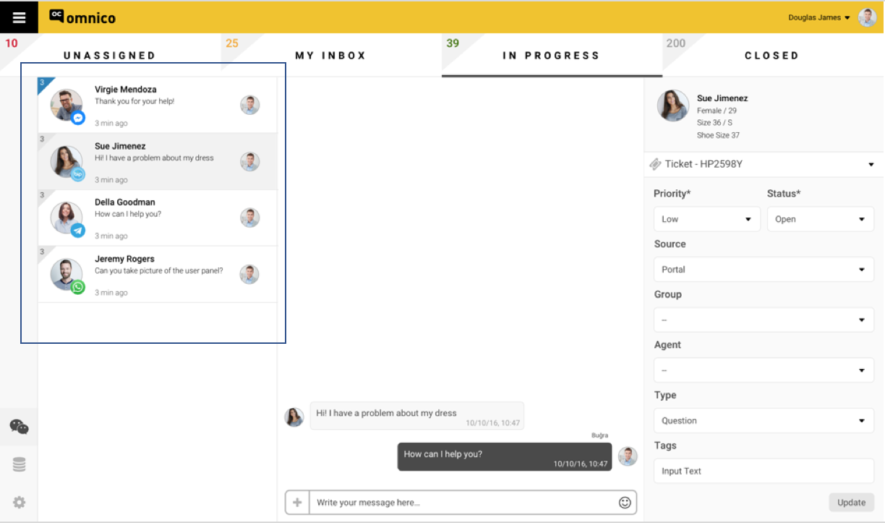

# Start Communicating with Your Customers!

After you are done with onboarding process, you can log in to your 'Omnico Agent Screen' and start converting conversations in to conversions.

## Omnico Agent Screen Feature Set 

**The screen below, is your 'Omnico Agent Screen'**

_The features and functions of the screen is as below;_

1. The area on the left, is your 'Universal Inbox', where you will be monitoring and receiving all of your customers' notifications.

In your universal inbox, for each notifications, you will be monitoring the data below:

● Customer Name
●	The logo of the Channel 
●	The received time

 

2. The marked area below is your 'chat box'. In this box, every agent will be monitoring and answering the notifications. 

3. The area on the right, is for 'Ticket Properties' & 'Customers Details'. 

**As Omnico, we call notifications 'Tickets'.** 

**What is a Ticket?**

Every request and notification sent to your support channels becomes a ticket in your helpdesk

**Ticket Properties & Customer Details**

●	Customer Details 

If you have aldready integrated your CRM & E-Commerce accounts with your Omnico account, then the data below will appear on your agent screen's right side. If not, you will be monitoring the data that have been colleted by Omnico throughout the time. 

1. Gender
2. Age
3. Size
4. Shopping Cart (if E-commerce & CRM integrations are made)

●	Ticket Properties 

Agents will be filling in the data below manually. 

1. Priority 

Low / Medium / High / Urgent 

2. Status 

Open / pending / resolved / closed / waiting on customer / waiting on third party 

3. Source 

Facebook Messenger / Telegram / Whatsapp / etc.

4. Group / Department 

5. Agent Name 

6. Activity Based Actions; Call Reason, Category, Sub Category 

Question
Incident 
Problem 
Feature Request 
▪	….

**Explanation**:
Every ticket can have more than one activity and each activity can have a different status and category. Each activity can be monitored via call time/status/etc. For a ticket to be completely 'solved', each 'activity based action' within a ticket must be in 'done' status. 

7. Tags (Tags are helpful for tracking tickets via predefined keywords)

## Omnico Ticket Journey

Each ticket will follow the the steps below in order to be 'resolved' or 'postponed'.

1.	My Inbox
2.	In Progress
3.	Closed

**My Inbox**

Each ticket is directed to an available agent automatically by the system. When a ticket is directed to an agent, the ticket appears in that agent's 'My Inbox'.  

**In Progress**

Agents will be able to manually carry a ticket from 'My Inbox' to 'In Progress' inbox. The difference between the two is that the tikets under 'In Progress' inbox are the ones that are being answered and that are ongoing.

**Closed**

When an agent is done with a ticket, he/she will manually carry the ticket to the 'Closed' inbox. 

Furthermore, after a ticket goes through the journey above, the ticket has to be tagged either as 'resolved' or 'postponed'. Sisteme düşen mesaj/bildiri, sırasıyla yukarıdaki adımları izledikten sonra, ‘resolved’ veya ‘postponed’ tag’leri ile tag’lenir.  If this ticket is;

**‘Resolved’** - automatically, the ticket is being transferred to Omnico's database.
**‘Postponed'** - the ticket is being transferred to another agent or to the database for future actions.

