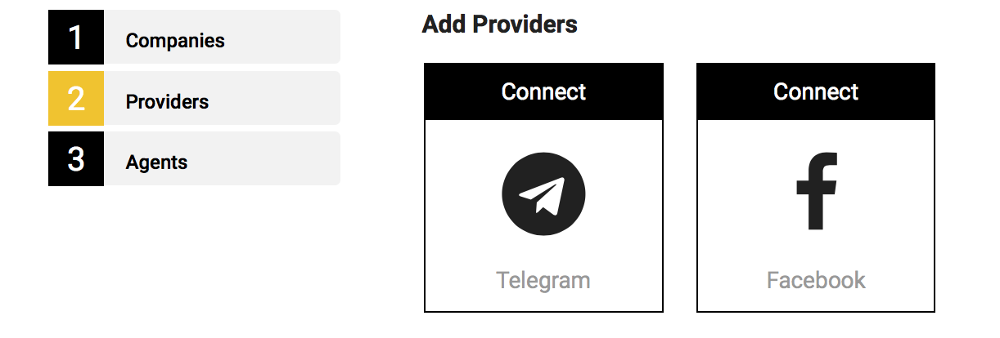
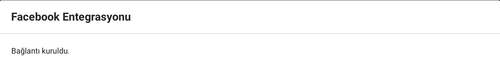

# Integration of Telegram & Facebook Accounts

1. After registration, the system will directly transfer you to the onboarding process. First, you will be integrating your Telegram & Facebook accounts with your Omnico account.

## Facebook Integration

1. In the page below, click to 'Connect'.

2. Click to ''Connect to Facebook'

3. Choose the Facebook page that you want to integrate with your Omnico account. 

4. Click to 'Connect'

5. Congratulations! Your Facebook Page has been successfully connected.  

## Telegram Integration

1. Download the Telegram Application
2. Log in the application
3. Go to the 'Chat' tab of the application.

4. Write down @BotFather in the search area.  

5. Open the 'Chat' and click to 'Start' 

6. When you click to 'Start', the below chat will pop up. In this chat, click to the '/newbot' link.

7. When you click to '/Newbot' link, the application will ask you to create a 'bot' name. (Ex: OmnicoTestBot)

8. After you create a 'bot' name, the application will provide you a 'bot name' and a 'Token':

9. After this step, go to your Omnico onboarding page and click to Telegram's 'Connect' button. 

10. When you press 'Connect', a page will appear. On this page, enter the 'bot name' and 'Token' that you have just created in the Telegram application.

11. Congratulations! Your Telegram account has been successfully connected.  

