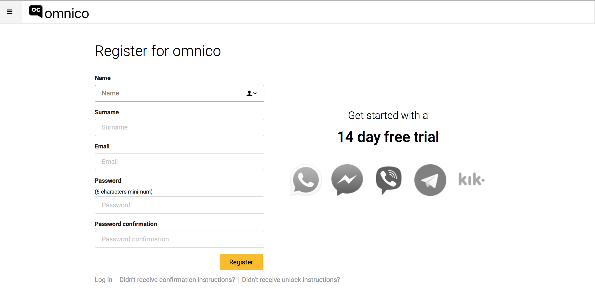
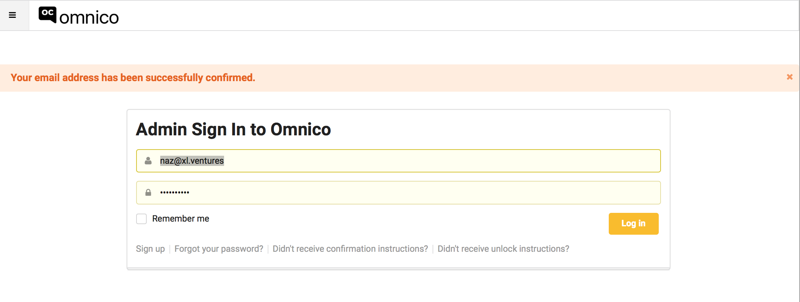
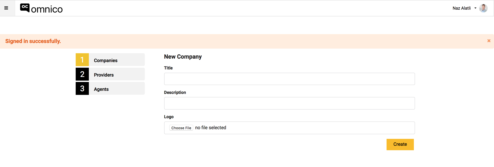

# Signin up to OmniCo &  Register Your Company

## Signing up to Omnico
1. Go to app.omnico.io
2. Click to '14 Days Free Trial'.
 

3. Enter your informtion into the given area and click to 'Register'

4. Click to 'Confirm My Account' link which is in the mail that has been sent to you.

5. After confirming your e-mail address, you will be directed to the page below. Here, verify your information and click to 'Log in' 

6. Congratulations! Now you are an Omnico member :) Welcome to the family!

## Registering Your Company

1. After you are logged in, you will be directed to the page below. 

2. Enter your company's information to the given area and upload your company's logo if you wish.

3. After entering the necessary information, click to 'Create' and establish your company's account. 
