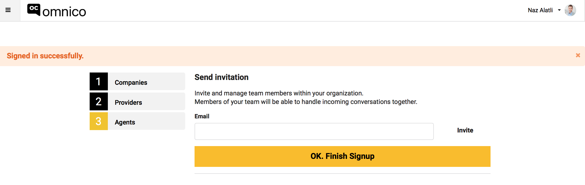

## Destek Ekiplerini davet etmek

1. Kanal entegrasyonlarınızı tamamladıktan sonra, bir sonraki adıma geçerek ekip arkadaşlarınızı davet edebilirsiniz. 
2. Aşağıdaki ekrandaki 'e-mail' kutucuğunun içine ekip arkadaşınızın mail adresini girip 'invite' butonuna basınız. 

3. Eklediğiniz ekip arkdaşınız ekranınızın 'Invitations' bölümünde belirecektir. 

4. Tebrikler! Omnico kurulumunu başarıyla tamamladınız. Şimdi Omnico'yu keşfedip, müşterilerinize mükemmel bir müşteri servisi deneyimi yaşatmaya başlayabilirsiniz!

