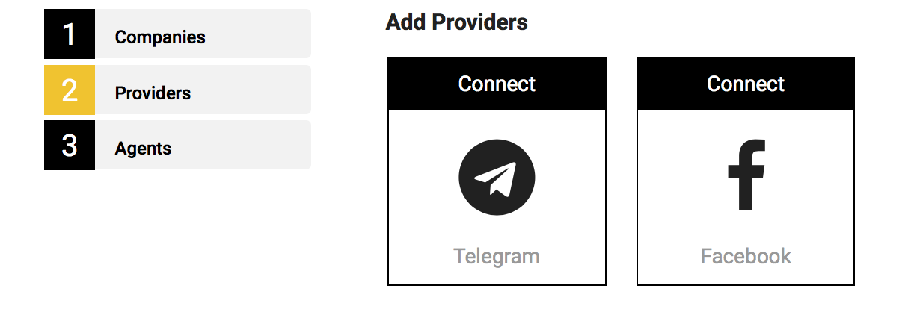
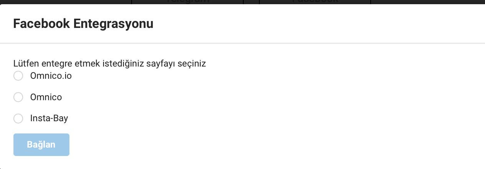
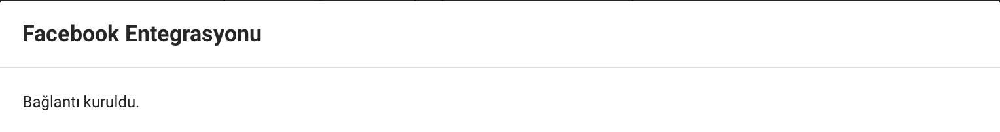

# Telegram ve Facebook platformlarını eklemek

1. Kuruluşunuzun kurulumunu tamamladıktan sonra, sistem sizi otomatik olarak 'Providers' etabına yönlendirecektir. 
2. Bu sayfada, karşınıza Facebook ve Telegram platformlarını ekleyebileceksiniz. 

## Facebook Entegrasyonu

1. Aşağıdaki ekran karşınıza çıktığında 'Connect'in üzerine basınız. 

2. ''Facebook'a bağlan' butonuna basınız.

3. Omnico hesabınıza entegre etmek istediğiniz Facebook Sayfanızı seçiniz.

4. 'Bağlan' butonuna basınız

5. Tebrikler! Facebook Sayfanız başarıyla kurulmuştur. 

## Telegram Entegrasyonu

1. Telefonunuza Telegram uygulamasını yükleyiniz.
2. Uygulamaya giriş yapınız.
3. Uygulamanın 'Chat' sekmesini seçiniz

