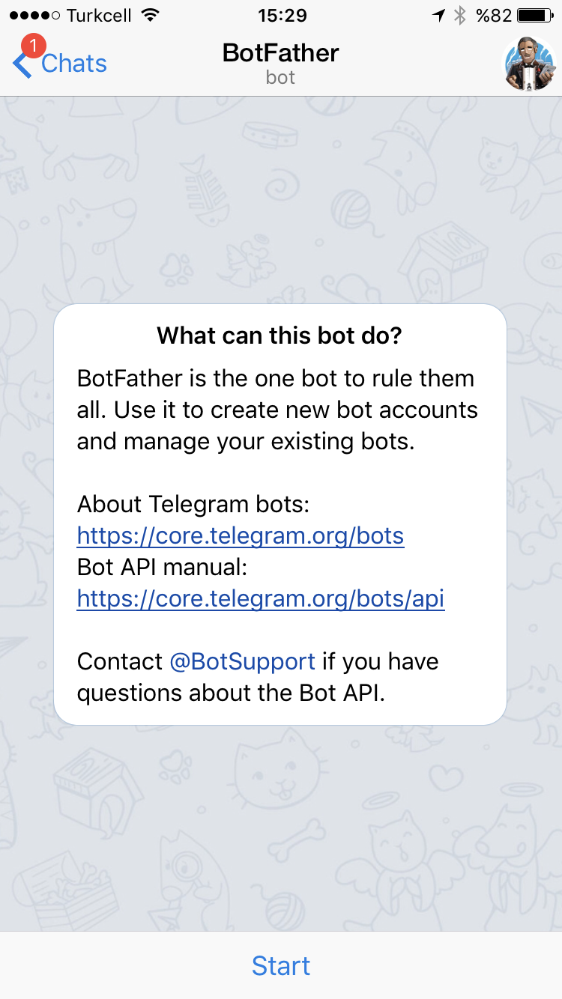
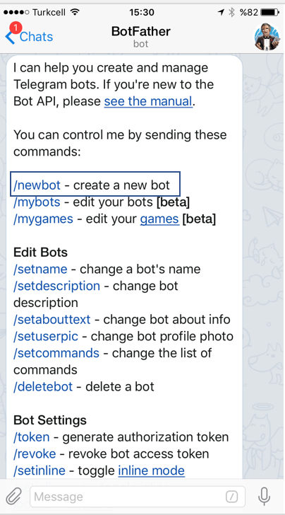
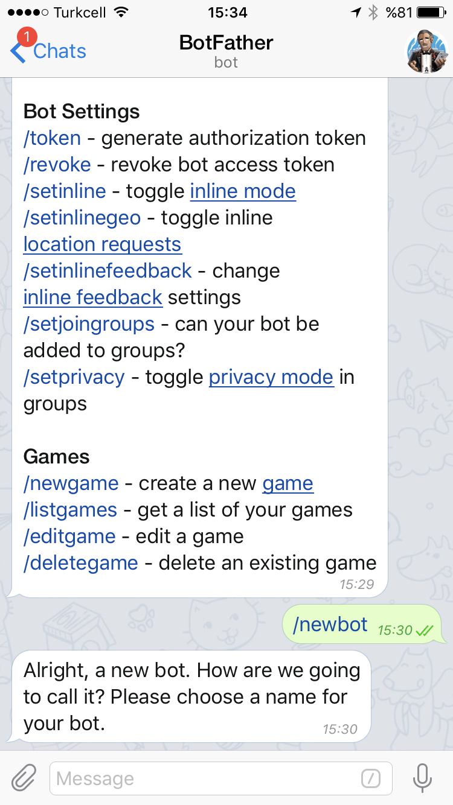
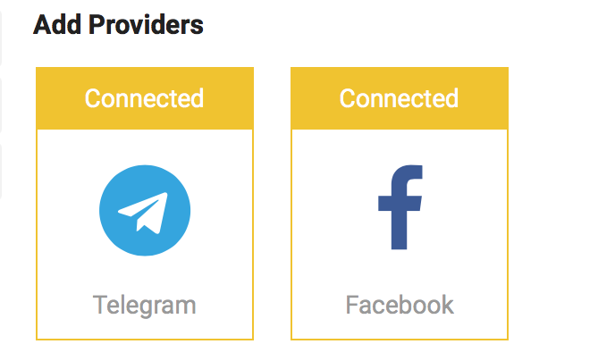

# Telegram ve Facebook platformlarını eklemek

1. Kuruluşunuzun kurulumunu tamamladıktan sonra, sistem sizi otomatik olarak 'Providers' etabına yönlendirecektir. 
2. Bu sayfada, karşınıza Facebook ve Telegram platformlarını ekleyebileceksiniz. 

## Facebook Entegrasyonu

1. Aşağıdaki ekran karşınıza çıktığında 'Connect'in üzerine basınız. 

2. ''Facebook'a bağlan' butonuna basınız.

3. Omnico hesabınıza entegre etmek istediğiniz Facebook Sayfanızı seçiniz.

4. 'Bağlan' butonuna basınız

5. Tebrikler! Facebook Sayfanız başarıyla kurulmuştur. 

## Telegram Entegrasyonu

1. Telefonunuza Telegram uygulamasını yükleyiniz.
2. Uygulamaya giriş yapınız.
3. Uygulamanın 'Chat' sekmesini seçiniz

4. Arama kısmına @BotFather yazıp aratınız. 

5. Üzerine tıklayarak 'chat' ekranını açınız ve 'start' tuşuna tıklayınız. 

6. 'Start' tuşuna bastığınızda ekranınızda aşağıdaki ekran belirecektir. Aşağıda işaretli olan '/newbot' linkine tıklayınız. 

7. '/Newbot' linkine tıkladığınızda, uygulama sizden bir 'bot' ismi üretmenizi isteyecektir. (örnek: OmnicoTestBot)

8. Seçtiğiniz isimi klavyeye girip gönderdikten sonra, uygulama size bot ismi ve Token sunacaktır:

9. Bot oluşturup, Token aldıktan sonra, Omnico ekranınızdaki Telegram 'Connect' butonuna basınız.

10. Burada istenilen alanlara, daha önce üretmiş olduğunuz bot ismini ve Token linkini giriniz. 

11. Tebrikler! Telegram entegrasyonunuz başarıyla kurulmuştur.

