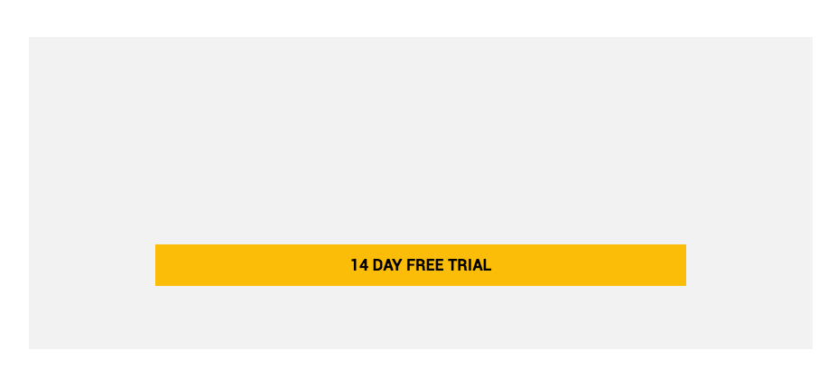
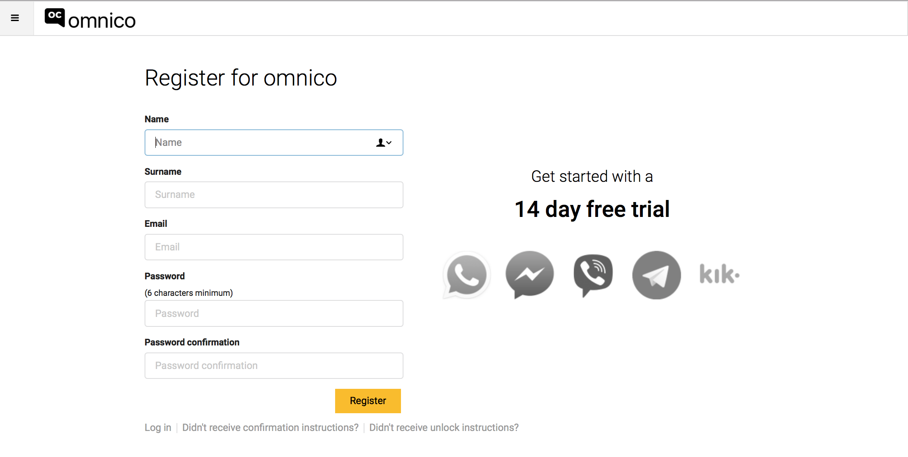
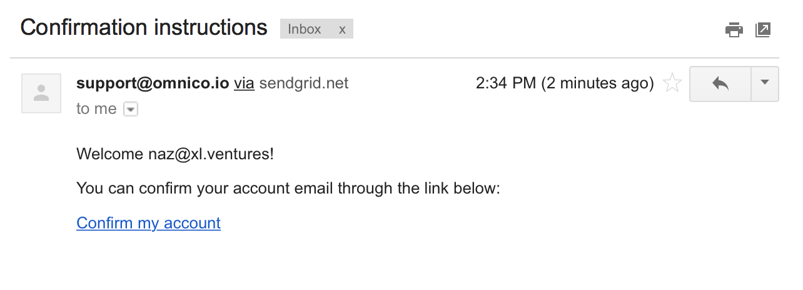
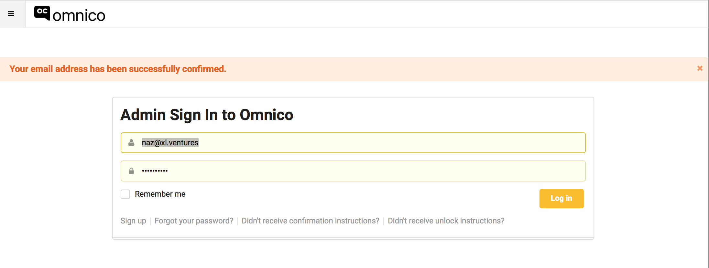
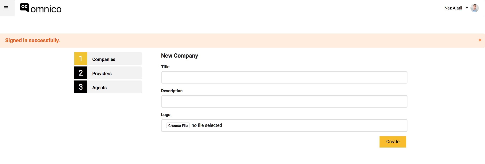
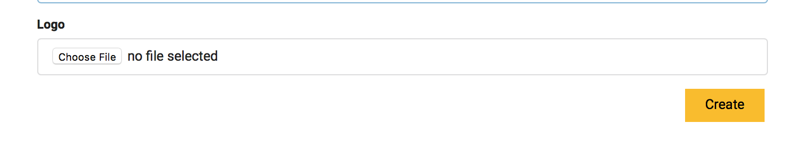

# OmniCo'ya Kayıt Olmak ve Kuruluşunuzu Tanımlamak

## Kayıt Olmak
1. App.omnico.io sayfasına giriş yapınız.
2. '14 Days Free Trial' butonuna basınız.
 

3. Aşağıdaki sayfaya bilgilerinizi giriniz ve 'Register' butonuna basınız.

4. E-mail hesabınıza gelen mail'deki 'Confirm My Account' linkine basınız. 

5. E-mail hesabınızı onayladıktan sonra aşağıdaki sayfaya yönlendirileceksiniz. Burada, bilgilerinizi kontrol edip, 'log in' olunuz. 

6. Tebrikler, artık bir Omnico kullanıcısısınız :) Aramıza hoşgeldiniz!

## Kuruluş Oluşturmak 

1. Sisteme 'Log In' olduktan sonra, aşağıdaki ekrana yönlendirileceksiniz.

2. Bu sayfadaki boş alanlara önce bilgilerinizi giriniz, isteğinize bağlı olarak, aşağıdaki link'e basarak, kuruluşunuzun logosunu yükleyiniz. 

3. Gerekli bilgileri girdikten sonra 'Create' butonuna basarak kuruluşunuzun hesabını oluşturunuz. 
